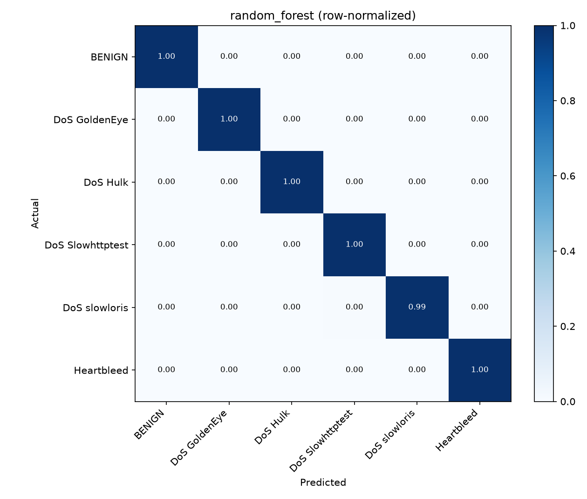
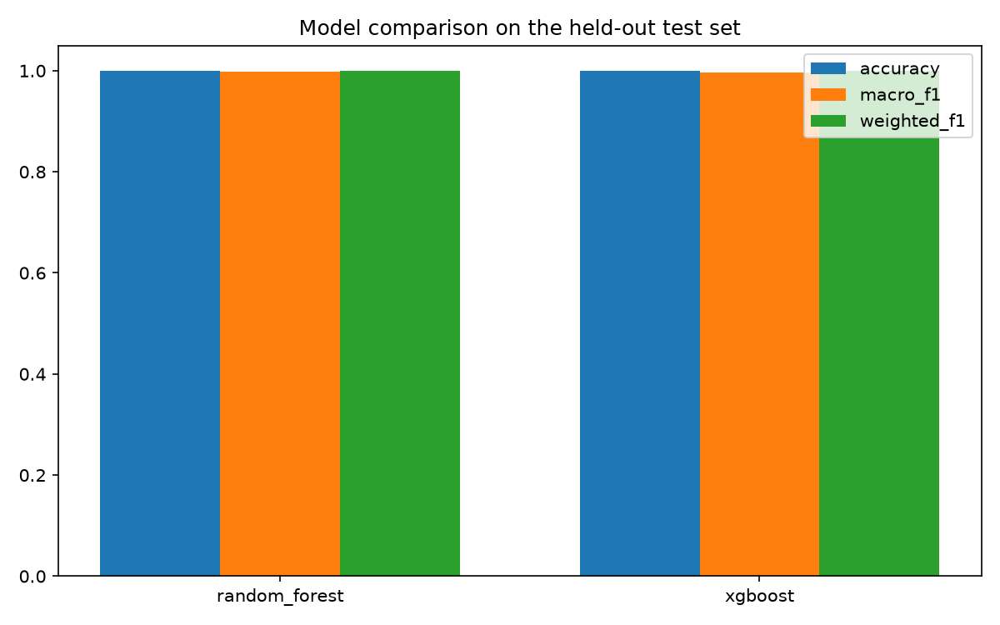
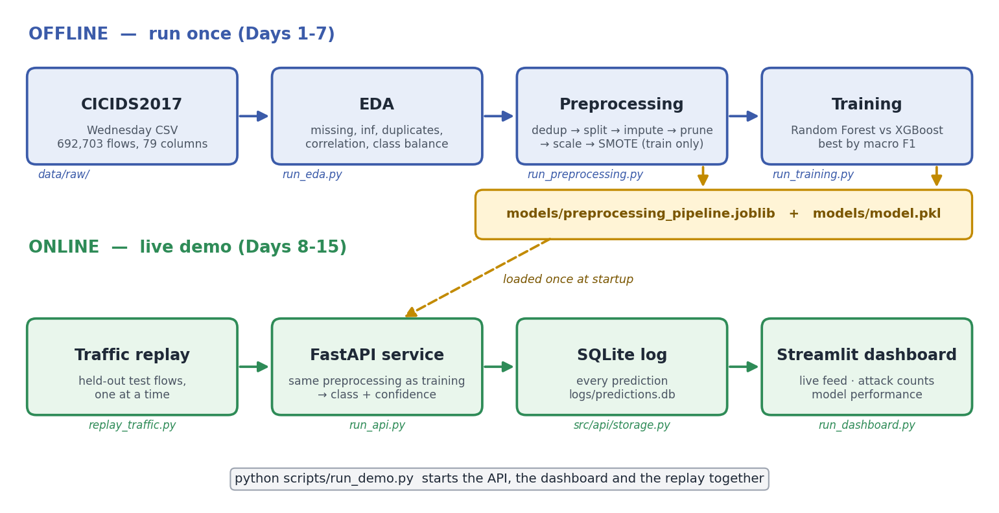

# ML-Based Network Intrusion Detection System (NIDS)

**Author:** Krishkumar (2401CS83), B.Tech CSE, IIT Patna

A machine learning system that classifies network traffic flows as benign or as a specific
attack type, using flow-based statistical features (packet timing, sizes, rates). It is built
end to end: dataset → leakage-safe preprocessing → trained model → FastAPI inference service
→ simulated live traffic → Streamlit dashboard.

## Results (CICIDS2017, Wednesday file)

Evaluated on a held-out test set of 122,159 flows that was never resampled, so the numbers
reflect the real class balance.

| Model | Accuracy | Macro F1 | Weighted F1 | Train time (s) |
|---|---|---|---|---|
| **Random Forest** (selected) | 0.9995 | 0.9974 | 0.9995 | 115 |
| XGBoost | 0.9994 | 0.9961 | 0.9994 | 63 |

Per-class results for the selected model:

| Class | Precision | Recall | F1 | Test flows |
|---|---|---|---|---|
| BENIGN | 0.9999 | 0.9997 | 0.9998 | 83,407 |
| DoS Hulk | 0.9994 | 0.9993 | 0.9993 | 34,570 |
| DoS GoldenEye | 0.9923 | 0.9985 | 0.9954 | 2,057 |
| DoS slowloris | 0.9981 | 0.9935 | 0.9958 | 1,077 |
| DoS Slowhttptest | 0.9905 | 0.9971 | 0.9938 | 1,046 |
| Heartbleed | 1.0000 | 1.0000 | 1.0000 | **2** (see limitations) |




Full tables, top features and plots: `reports/MODEL_REPORT.md`, `reports/EDA_REPORT.md`,
`reports/figures/`.

**How to read these numbers.** Near-perfect scores are normal for CICIDS2017 DoS traffic: DoS
attacks leave very distinctive flow statistics. They show the pipeline is sound on this day of
data, not that the model would catch attacks on a different network. See *Known limitations*.

## Architecture



```
Dataset (CICIDS2017 Wednesday CSV)
   |
EDA            inspect only, nothing is changed          scripts/run_eda.py
   |
Preprocessing  clean, split, scale, balance (train only) scripts/run_preprocessing.py
   |
Training       Random Forest vs XGBoost, best by macro F1 scripts/run_training.py
   |
FastAPI        POST a flow -> class + confidence         scripts/run_api.py
   |
Replay         held-out flows streamed to the API        scripts/replay_traffic.py
   |
Dashboard      live feed + model performance (Streamlit) scripts/run_dashboard.py
```

## Dataset

**CICIDS2017** (Canadian Institute for Cybersecurity), the Wednesday daily CSV from the
`MachineLearningCVE` release: 692,703 flows, 79 columns, six classes:

| Class | Flows (raw) |
|---|---|
| BENIGN | 440,031 |
| DoS Hulk | 231,073 |
| DoS GoldenEye | 10,293 |
| DoS slowloris | 5,796 |
| DoS Slowhttptest | 5,499 |
| Heartbleed | 11 |

This file contains **only** benign traffic, four DoS variants and Heartbleed. It has no Port Scan,
Brute Force or Botnet traffic, so the model does not detect those.

Get the data from the official CICIDS2017 distribution (download links move, so search for the
current one) and put the CSV in `data/raw/`. The dataset is not stored in this repo.

## Preprocessing (and why the order matters)

The rule: anything that *learns* from the data is fit on the training split only, then applied
to the test split. Otherwise test information leaks into training and the scores are inflated.

1. Drop duplicate rows: 81,909 removed (11.8%), leaving 610,794.
2. Drop identifier columns (Flow ID, IPs, Timestamp) if present. This release of the data has
   none, so nothing was dropped here.
3. Encode labels and make a stratified 80/20 split (488,635 train / 122,159 test).
4. Replace `inf` with NaN and fill with **training** medians.
5. Drop one column from each highly correlated pair (|r| ≥ 0.90, found on training data):
   78 features reduced to 46.
6. StandardScaler fit on training data.
7. SMOTE on the **training set only** (488,635 → 2,001,768 rows). The test set is never resampled.

Everything the API needs at inference time (medians, scaler, exact column order, label encoder)
is saved in `models/preprocessing_pipeline.joblib`, so live traffic goes through identical steps.

## Demo

One command starts the API, the dashboard and a traffic replay together (after you have run
preprocessing and training once, see *Quick start*):

```
python scripts/run_demo.py
```

It opens the dashboard in your browser and streams held-out flows into the API until you press
Ctrl+C, which stops everything cleanly. Useful options: `--count 300` (send 300 flows, then keep
the servers up) and `--interval 0.2` (faster arrival).

## Quick start

```
git clone https://github.com/Krish290107/nids-project.git
cd nids-project
python -m venv venv
venv\Scripts\activate            # Windows   (Linux/macOS: source venv/bin/activate)
pip install -r requirements.txt

# put the CICIDS2017 CSV in data/raw/, then:
python scripts/run_eda.py
python scripts/run_preprocessing.py
python scripts/run_training.py
```

No dataset yet? `python scripts/generate_sample_data.py` creates a small synthetic CSV so you can
check that the whole pipeline runs. Delete it once you have the real data.

If training is slow or runs out of memory, set `training.max_train_rows` in `configs/config.yaml`.

### Run the live demo step by step (three terminals)

The same thing as `python scripts/run_demo.py`, but with each part in its own terminal:

```
python scripts/run_api.py                                   # 1. API    -> http://127.0.0.1:8000/docs
python scripts/replay_traffic.py --count 200 --interval 0.1 # 2. stream held-out flows into the API
python scripts/run_dashboard.py                             # 3. dashboard -> http://localhost:8501
```

`replay_traffic.py` also accepts `--loop` (stream until Ctrl+C). `scripts/test_api_client.py`
sends test flows to the API and checks it agrees with the model run offline.

### API endpoints

| Endpoint | Purpose |
|---|---|
| `GET /health` | Is the service up and a model loaded |
| `GET /model-info` | Model name, classes, the exact feature names required |
| `POST /predict` | Classify one flow (`{"features": {...}}`) |
| `POST /predict/batch` | Classify up to 1000 flows (`{"flows": [...]}`) |
| `GET /predictions/recent` | Latest logged predictions |
| `GET /stats` | Counts per predicted class |

Missing features return a 422 that lists which ones; null/inf/NaN values are filled with the
training medians. Every prediction is logged to `logs/predictions.db` (SQLite), which the
dashboard reads directly, so it works even after the API has stopped.

### Tests

```
pytest tests/
```

60 tests covering data loading, preprocessing, model evaluation, the API, the replay logic, the
demo launcher helpers and the dashboard. The dashboard tests run against a temporary folder and never touch your real logs or
reports.

## Project structure

```
nids-project/
├── configs/config.yaml        all paths and settings; nothing is hardcoded
├── data/{raw,interim,processed}   datasets (not committed)
├── models/                    model.pkl, preprocessing_pipeline.joblib (not committed)
├── reports/                   EDA_REPORT.md, MODEL_REPORT.md, figures/, metrics/
├── scripts/                   run_eda, run_preprocessing, run_training, run_api,
│                              replay_traffic, run_dashboard, run_demo, test_api_client, generate_sample_data
├── src/
│   ├── data/                  load_dataset.py, eda.py
│   ├── preprocessing/         pipeline.py
│   ├── models/                train.py, evaluate.py
│   ├── api/                   main.py, inference.py, storage.py, schemas.py, replay_utils.py
│   ├── dashboard/             app.py, data_access.py
│   └── utils/                 paths.py, logging_config.py, demo.py
├── docs/                      architecture.png
└── tests/
```

## Known limitations

- **Heartbleed is not a real result.** The whole file has only 11 Heartbleed flows, and the test
  set contains **2** of them. A perfect score on 2 flows means nothing, and the handful left for
  training (at most 9, fewer if duplicates were removed) is expanded by SMOTE into hundreds of
  thousands of synthetic rows. Treat Heartbleed as unvalidated.
- **One day of one dataset.** Results do not show how the model behaves on other days, other
  attack types, or a real network. A fair next test is training on Wednesday and evaluating on a
  different day.
- **Model selection uses the test set.** The better of the two models is chosen on the same
  held-out set it is reported on (there is no separate validation split), which adds a small
  optimistic bias.
- **The replay is a simulation.** It streams held-out, already-extracted flow records into the
  API. It is not live packet capture, and there is no flow extractor (such as CICFlowMeter) here.
- **Needs internet for the visuals.** The dashboard charts and the `/docs` page load Chart.js,
  Swagger UI and Google Fonts from CDNs, so they appear blank offline.
- **The API is for local use.** It binds to 127.0.0.1 and has no authentication.

## Future work

- Add a validation split for model selection, and evaluate across days (train Wednesday, test Friday).
- Add attack types beyond DoS by combining more daily CICIDS2017 files.
- Explainability for individual alerts (SHAP).
- Real flow extraction from captured traffic.
